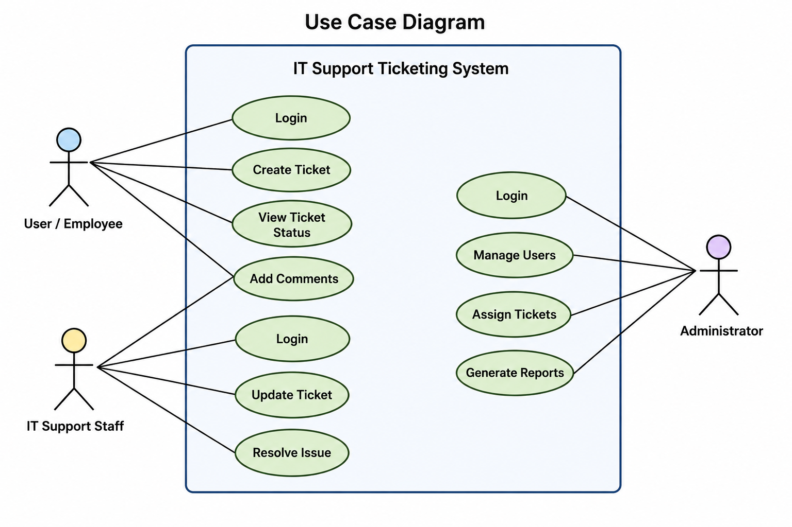

## IT Support Ticketing System

## Project Overview
The IT Support Ticketing System is a web-based application designed to help users report technical issues and request IT support services. The system enables efficient ticket creation, tracking, and resolution management.

## Problem Statement
Many organizations manage IT support requests through emails, phone calls, or manual records, which can lead to delays, lost requests, and poor communication. A centralized ticketing system is needed to efficiently track, manage, and resolve IT support issues.

## Project Objectives
- To provide a centralized platform for managing IT support requests.
- To allow users to create and track support tickets.
- To improve communication between users and IT support staff.
- To monitor the status of reported issues until resolution.
- To maintain a record of all support requests for future reference.
# IT Support Ticketing System

## 👥 Users
- 👤 User / Employee
- 🛠️ IT Support Staff
- 👨‍💼 Administrator

## 📦 Modules
- 🔐 User Management
- 🎫 Ticket Management
- 📋 Ticket Assignment
- ✅ Issue Resolution
- 💬 Comments
- 🔔 Notification
- 📊 Reports & Dashboard

## Use Case Diagram

